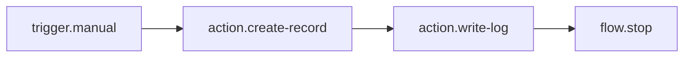

# Capture Product Audit Snapshot Workflow

This is the most elaborate built-in workflow demo in MetaRecord. It is the default workflow the editor opens on startup, and it is designed to exercise the full happy path of the workflow runtime:

- a manual trigger
- a metadata-backed record creation step
- a structured log step
- an explicit stop step

It also depends on the seeded demo metadata for both `Product` and `WorkflowAuditEntry`.

Related source:

- [Demo metadata seeder](../src/Workflows/DemoMetadataSeeder.cs)
- [Demo workflow seeder](../src/Workflows/DemoWorkflowSeeder.cs)
- [Workflow editor default selection](../src/MetaRecord.Editor/src/workflow/WorkflowEditor.tsx)
- [Workflow API tests](../tests/MetaRecord.Core.Tests/Workflows/WorkflowApiTests.cs)

## Editor Panels

The workflow opens in the visual editor, which is split into a few clear areas:

| Panel | What it does |
|---|---|
| Top toolbar | Shows the workflow name, object, event, enabled state, and the `Save`, `Validate`, `Enable`, and `Disable` actions. |
| Notice bar | Shows short success or error messages after actions such as saving, validating, or running a test. |
| Left rail, workflow list | Lists all seeded workflows, lets you open one, and lets you create a new draft. |
| Left rail, node palette | Shows the available node types you can add to the current workflow. |
| Center canvas | Displays the actual workflow graph and lets you select and rearrange nodes. |
| Right rail, inspector | Shows the selected node details and any editable node properties. |
| Bottom rail, validation | Shows validation issues and helps you jump to the affected node. |
| Bottom rail, test input | Lets you supply sample record data and run the selected workflow. |
| Bottom rail, run history | Shows past runs and the node-by-node results for each run. |

The rest of this document walks through the selected demo workflow inside those panels.

## First Clicks

If you are new to the app, start here:

1. Open the editor and wait for `Capture product audit snapshot` to load.
2. Click the workflow card in the left rail if it is not already selected.
3. Read the top toolbar first. It tells you the object, event, and whether the workflow is enabled.
4. Look at the center canvas next. It shows the actual control flow from trigger to stop.
5. Use the bottom-right run history only after you run the workflow once, because that panel becomes more useful after the first execution.

The shortest useful demo path is: open the workflow, run it once, inspect the node output, then read the run history entry.

## Screenshot-Style Tour

Think of the editor like this:

```text
Top bar:      workflow name, save/validate/enable/disable
Left rail:    open workflow list and node palette
Center:       visual canvas for the workflow graph
Right rail:   inspector for the selected node
Bottom left:  validation issues
Bottom middle: test input and run button
Bottom right: run history and step details
```

For a live demo, the most useful panel order is:

1. Top bar to confirm you are on the correct workflow.
2. Left rail to verify the seeded demo workflow is selected.
3. Center canvas to explain the node flow.
4. Bottom middle to run the test.
5. Bottom right to show the resulting run record.
6. Right rail only when you want to explain or edit a node.

## Workflow Shape



## What The Workflow Does

The workflow is named `Capture product audit snapshot` and is attached to the `Product` object with a `Manual` event. That means it runs when you execute it from the editor test panel rather than from a record lifecycle event like `Created` or `BeforeSave`.

At runtime, the test input supplies a sample `currentRecord` object. The workflow copies values from that input into a new `WorkflowAuditEntry` record, writes a log message, and then stops the branch.

## Step By Step

### 1. Manual Trigger

Node type: `trigger.manual`

This is the entry point. The workflow starts only when you explicitly run it in the editor or through the test-run API.

Input source:

- `currentRecord`
- `event.WorkflowId`
- `event.EventName`

### 2. Create Audit Record

Node type: `action.create-record`

This node creates a new `WorkflowAuditEntry` record. It is the most important step in the demo because it proves the workflow can write a second metadata-backed object, not just read or log data.

Field mapping:

| Audit field | Expression | Purpose |
|---|---|---|
| `ProductName` | `{{currentRecord.Name}}` | Copies the product name into the audit row |
| `ProductPrice` | `{{currentRecord.Price}}` | Captures the product price |
| `Quantity` | `{{currentRecord.Quantity}}` | Captures the current quantity |
| `WorkflowId` | `{{event.WorkflowId}}` | Records which workflow produced the audit row |
| `EventName` | `{{event.EventName}}` | Records the trigger type |
| `Note` | `Manual audit snapshot for {{currentRecord.Name}}` | Adds a human-readable summary |

### 3. Write Log

Node type: `action.write-log`

After the audit row is created, the workflow writes a structured log entry:

- `Audit snapshot created for {{currentRecord.Name}}.`

This gives you a runtime trace that is easy to inspect in the run history.

### 4. Stop

Node type: `flow.stop`

The final node ends the branch explicitly. It does not add more business behavior, but it makes the workflow shape clearer and demonstrates how the runtime handles terminal flow nodes.

## How To Run It

### Option 1: One-command launcher

From the repository root, run:

```powershell
.\Start-MetaRecordMvp.ps1
```

This starts the API and the React editor, then opens the editor automatically. The editor is configured to open `Capture product audit snapshot` by default when the demo data is present.

### Option 2: Start the pieces manually

Start the API:

```powershell
dotnet run --project src/MetaRecord.Web/MetaRecord.Web.csproj --urls http://127.0.0.1:5050
```

Start the editor:

```powershell
$env:VITE_API_PROXY_TARGET = "http://127.0.0.1:5050"
npm --prefix src/MetaRecord.Editor run dev
```

If port `5050` is already in use, the helper script will fall back to the next free port automatically.

## How To Test It

### Browser Test

1. Open the editor.
2. Confirm `Capture product audit snapshot` is selected.
3. Use the Test Input panel and keep the sample `Product` values or change them.
4. Click `Run`.
5. Confirm the run finishes with `Succeeded`.
6. Open the run history entry and verify the steps include `trigger.manual`, `action.create-record`, `action.write-log`, and `flow.stop`.

### Automated Test

Run the workflow API tests:

```powershell
dotnet test tests/MetaRecord.Core.Tests/MetaRecord.Core.Tests.csproj --filter FullyQualifiedName~WorkflowApiTests
```

The test suite covers:

- demo metadata seeding
- demo workflow seeding
- the hero workflow execution path

## Expected Result

When the workflow runs successfully, you should see:

- a saved `WorkflowAuditEntry` record in SQLite
- a `Succeeded` run in the Run History panel
- node-level output for the create-record and log steps

If the workflow does not appear, start the app with the helper script so the demo metadata and workflows are seeded before the editor loads.